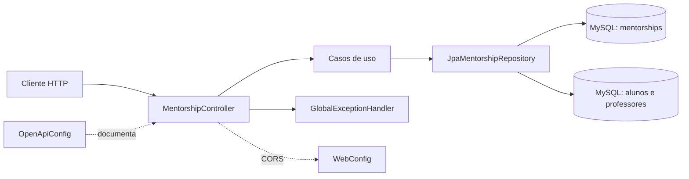

# Mapa do projeto

## Visão geral

O `mentorship-service` é um microsserviço Spring Boot responsável pelo ciclo de vida de solicitações de mentoria entre alunos e professores. Ele persiste as mentorias em MySQL e consulta tabelas de alunos e professores para montar as respostas enriquecidas.



## Estrutura por camada

| Pacote | Responsabilidade | Componentes |
| --- | --- | --- |
| `com.menthfy.demo` | Inicialização da aplicação e escaneamento Spring | `DemoApplication` |
| `com.menthfy.presentation.controller` | Entrada HTTP e roteamento REST | `MentorshipController` |
| `com.menthfy.presentation.exceptions` | Conversão de exceções de negócio em respostas HTTP | `GlobalExceptionHandler` |
| `com.menthfy.application.dto` | Contratos de entrada e saída da API | `MentorshipRequest`, `MentorshipResponse`, `StudentMentorshipResponse` |
| `com.menthfy.application.usecases` | Regras de aplicação e orquestração | `Create`, `Accept`, `Cancel`, `GetByStudent`, `GetByTeacher` |
| `com.menthfy.domain.models` | Modelo persistente do domínio | `Mentorship` |
| `com.menthfy.infrastructure.persistence` | Acesso JPA e consultas enriquecidas | `JpaMentorshipRepository`, `MentorshipEntity` |
| `com.menthfy.config` | Configuração transversal | `WebConfig`, `OpenApiConfig` |

## Fluxo de requisição

1. O cliente chama uma rota em `/api/mentorships`.
2. `MentorshipController` converte a entrada HTTP em uma chamada de caso de uso.
3. O caso de uso aplica a regra de negócio e usa `JpaMentorshipRepository`.
4. O repositório persiste `Mentorship` ou executa uma consulta nativa enriquecida.
5. O controller serializa a entidade ou DTO como JSON.
6. `GlobalExceptionHandler` transforma `RuntimeException` em HTTP 400 com `{ "message": "..." }`.

## Contrato REST atual

| Método | Rota | Resultado |
| --- | --- | --- |
| `POST` | `/api/mentorships` | Cria uma mentoria com status `PENDING` |
| `PUT` | `/api/mentorships/{id}/accept` | Altera o status para `ACCEPTED` |
| `PUT` | `/api/mentorships/{id}/cancel` | Altera o status para `CANCELLED` |
| `GET` | `/api/mentorships/student/{id}` | Lista dados do professor para um aluno |
| `GET` | `/api/mentorships/teacher/{id}` | Lista o nome do aluno para um professor |

A especificação interativa é servida pelo Springdoc em `/swagger-ui.html`; o documento JSON fica em `/v3/api-docs`.

## Modelo e persistência

`Mentorship` é uma entidade JPA na tabela `mentorships` com os campos:

- `id`: chave primária gerada pelo banco;
- `studentId`: identificador do aluno;
- `teacherId`: identificador do professor;
- `status`: estado textual do ciclo de vida.

O repositório usa consultas derivadas para buscas simples e SQL nativo para juntar:

- `mentorships` com `alunos`, retornando dados para a visão do professor;
- `mentorships` com `professores`, retornando dados para a visão do aluno.

Os identificadores de alunos, professores e seus dados de perfil pertencem às tabelas consultadas; este serviço não possui entidades JPA para esses agregados.

## Configuração e execução

- Java 21 e Spring Boot 4.0.
- MySQL configurado por `DB_URL`, `DB_USER` e `DB_PASS`.
- Porta HTTP configurada por `MENTORSHIP_PORT`, com padrão `8080`.
- Origens CORS configuradas por `CORS_ALLOWED_ORIGINS` e aplicadas somente a `/api/**`.
- `docker-compose.yml` fornece o container MySQL e a aplicação.
- `spring.jpa.hibernate.ddl-auto=update` mantém o schema durante o desenvolvimento.

Comandos principais:

```bash
./mvnw test
./mvnw javadoc:javadoc
```

## Observações de comportamento

- A criação impede uma segunda solicitação `PENDING` para o mesmo aluno e professor.
- O cancelamento de uma mentoria já cancelada gera erro de negócio.
- Mentorias inexistentes geram HTTP 400 pela política atual do handler.
- O controller não declara `201 Created`; portanto, a criação retorna o status padrão `200 OK` do Spring.
- `MentorshipEntity` está reservado para uma futura separação entre modelo de domínio e modelo de persistência; atualmente `Mentorship` é a entidade JPA usada pelo repositório.